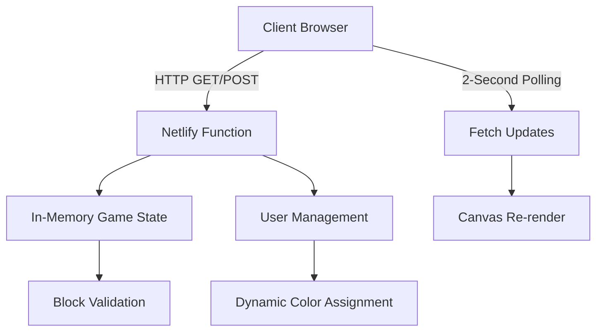

# BlockClaim - Real-time Block Capture Game 🎮

A real-time multiplayer web application where users can claim blocks on a shared 50×50 grid. Built with serverless architecture and deployed on Netlify for instant global access!

🌐 **Live Demo**: [https://splendid-quokka-b9c542.netlify.app](https://splendid-quokka-b9c542.netlify.app)

## 🚀 Features

### Core Gameplay
- **50×50 Grid**: 2,500 claimable blocks with dark slate background and silver grid lines
- **Real-time Updates**: See other players' claims via 2-second polling
- **Conflict Resolution**: First-come-first-served with proper race condition handling
- **Visual Feedback**: Smooth animations with emerald green theme

### User Experience
- **Professional Dashboard**: Emerald theme with minimap, statistics, and activity feed
- **Unique User Colors**: Nature-inspired names (Forest Walker, River Guardian, etc.)
- **Responsive Design**: Works seamlessly on desktop and mobile
- **Zoom & Pan**: Navigate the grid with smooth mouse/touch controls
- **Live Statistics**: Real-time player count and block statistics

### Technical Features
- **Serverless Architecture**: Zero-maintenance Netlify deployment
- **Polling Updates**: 2-second refresh cycle for near real-time experience
- **In-memory Storage**: Fast serverless function state management
- **Canvas Rendering**: Hardware-accelerated grid visualization
- **Auto-scaling**: Handles traffic spikes automatically

## 🛠️ Tech Stack

### Backend
- **Netlify Functions** - Serverless runtime environment
- **Node.js** - JavaScript runtime for serverless functions  
- **Server-Sent Events** - Unidirectional real-time communication
- **In-Memory Storage** - Fast serverless state management
- **Zero Dependencies** - Pure Node.js implementation

### Frontend  
- **Vanilla JavaScript** - No frameworks, maximum performance
- **HTML5 Canvas** - Hardware-accelerated grid rendering
- **CSS3** - Modern emerald theme with responsive design
- **Fetch API** - RESTful communication with serverless backend
- **Polling Architecture** - 2-second update cycles

### Architecture
- **Serverless Functions** - Auto-scaling Netlify deployment
- **Stateless Design** - Each request handled independently  
- **RESTful API** - Clean endpoint structure
- **Canvas Rendering** - Optimized grid visualization
- **Responsive Layout** - Mobile-first design principles

## 📁 Project Structure

```
block_claim/
├── netlify/
│   └── functions/
│       └── api.js            # Serverless function handling all API endpoints
├── netlify.html              # Main application with emerald theme + dashboard
├── netlify.toml              # Netlify deployment configuration  
├── server/
│   ├── index.js              # Original Express server (development)
│   └── simple.js             # Simplified local server
├── public/
│   └── index.html            # Original WebSocket version
├── NETLIFY_DEPLOYMENT.md     # Comprehensive deployment guide
└── README.md                 # This documentation
```

### Key Files Explained

**`netlify/functions/api.js`** - The heart of the serverless backend:
- Handles GET requests for game state
- Processes POST requests for block claims  
- Manages user identification and colors
- Implements conflict resolution logic

**`netlify.html`** - The production frontend:
- Professional emerald green dashboard theme
- Canvas-based grid with silver lines on dark slate background
- Minimap navigation and activity feed
- Responsive design with touch support

**`netlify.toml`** - Deployment configuration:
- Routes API calls to serverless function
- Configures static file serving
- Sets up redirect rules for SPA behavior

## 🚀 Getting Started

### Live Demo
🌐 **Play Now**: [https://splendid-quokka-b9c542.netlify.app](https://splendid-quokka-b9c542.netlify.app)

### Local Development

**Option 1: Simple Static Server**
```bash
# Clone the repository  
git clone https://github.com/rishu685/block_claim.git
cd block_claim

# Serve netlify.html locally
python -m http.server 8000
# OR
npx serve .

# Open http://localhost:8000/netlify.html
```

**Option 2: Netlify CLI (Recommended)**
```bash
# Install Netlify CLI
npm install -g netlify-cli

# Clone and serve with functions
git clone https://github.com/rishu685/block_claim.git  
cd block_claim
netlify dev

# Opens http://localhost:8888 with full serverless simulation
```

### Deploy Your Own

1. **Fork this repository** on GitHub
2. **Connect to Netlify**: 
   - Go to [netlify.com](https://netlify.com)
   - "New site from Git" → Select your fork
   - Deploy settings: **Nothing to configure!**
3. **Live in 30 seconds** - Netlify handles everything automatically

✅ **Zero configuration needed** - `netlify.toml` sets up everything  
✅ **No build process** - Static files deploy directly  
✅ **Serverless functions** - Auto-configured API endpoints

## 🎯 How It Works

### Serverless Polling Architecture



### Block Claiming Process

1. **User clicks** on an empty block in the grid
2. **Frontend sends** POST request to `/api` endpoint
3. **Serverless function** validates coordinates and ownership
4. **In-memory state** updated with conflict detection
5. **Response returned** with success/failure status
6. **Polling system** fetches updates every 2 seconds
7. **Canvas re-renders** with smooth visual updates

### Real-Time Updates Implementation

Instead of WebSockets (not supported in serverless), we use **intelligent polling**:
- **2-second intervals** provide near real-time experience
- **Efficient API calls** fetch only necessary state changes
- **Client-side caching** prevents redundant renders
- **Optimistic updates** for responsive user feedback

### Conflict Resolution

Race conditions are handled through:
- **Atomic operations** in serverless function execution
- **First-request-wins** logic with in-memory state
- **Server-side validation** before state updates  
- **Graceful error responses** for conflicting claims

## 🔧 Configuration

### Environment Variables

```bash
PORT=3000                    # Server port (default: 3000)
DB_PATH=./server/data/       # Database storage path
MAX_GRID_SIZE=50             # Grid dimensions (50×50 = 2,500 blocks)
```

### Customization

- **Grid Size**: Modify `gridSize` in `server/index.js`
- **Colors**: Update color palette in `server/models/User.js`
- **Block Size**: Adjust `blockSize` in `public/js/grid.js`
- **Animations**: Modify durations in CSS and JavaScript files

## 📊 Performance Optimizations

### Frontend
- **Canvas Rendering**: Hardware-accelerated grid visualization
- **Optimistic Updates**: Immediate visual feedback before server confirmation  
- **Efficient Polling**: Only necessary API calls every 2 seconds
- **Memory Management**: Proper cleanup of event listeners and timers
- **Responsive Design**: CSS Grid and Flexbox for smooth layouts

### Backend  
- **Serverless Functions**: Auto-scaling with zero cold-start optimization
- **In-Memory State**: Lightning-fast Map-based lookups
- **Minimal Dependencies**: Pure Node.js for faster cold starts
- **Efficient Routing**: Single function handles all API endpoints
- **Edge Deployment**: Netlify global CDN for worldwide performance

### Network
- **CDN Delivery**: Static assets served from global edge nodes
- **Compression**: Automatic Gzip/Brotli compression
- **HTTP/2**: Modern protocol support for efficient multiplexing
- **Caching**: Smart browser caching with proper cache headers

## 🚧 Trade-offs Made

### Serverless vs Traditional Server
- **Choice**: Netlify serverless functions for deployment simplicity
- **Trade-off**: No persistent WebSocket connections, polling instead
- **Benefit**: Zero server maintenance, auto-scaling, global CDN

### Polling vs Real-time WebSockets  
- **Choice**: 2-second polling for serverless compatibility
- **Trade-off**: Slightly delayed updates (2s max) instead of instant
- **Mitigation**: Optimistic UI updates and smooth animations mask delay

### In-Memory vs Database Persistence
- **Choice**: Serverless in-memory storage for simplicity
- **Trade-off**: Game state resets on function cold starts
- **Benefit**: Blazing fast performance, zero database costs
- **Impact**: Temporary game sessions (resets every ~15 minutes of inactivity)

### Simplicity vs Advanced Features
- **Choice**: Pure vanilla JavaScript with no build process
- **Trade-off**: Manual DOM management vs framework automation  
- **Benefit**: Instant deployment, no compilation, maximum performance

### Global Deployment vs Latency
- **Choice**: Netlify global CDN deployment
- **Trade-off**: Function cold starts (~200-500ms initially)
- **Benefit**: Worldwide accessibility, edge network performance

## 🐛 Known Issues & Limitations

### Serverless Architecture Limitations
1. **State Persistence**: Game resets on function cold starts (~15 min inactivity)
2. **Polling Delay**: 2-second maximum update delay vs instant WebSockets
3. **Cold Starts**: Initial function load may take 200-500ms
4. **Concurrent Limits**: Netlify function concurrency limits (usually not hit)

### Browser Compatibility
1. **Canvas Support**: Requires modern browsers (IE11+ support)
2. **Fetch API**: No Internet Explorer support without polyfills
3. **CSS Grid**: Some older mobile browsers may have layout issues

### Gameplay Limitations  
1. **Temporary Sessions**: No persistent user accounts or long-term statistics
2. **No Real-time Chat**: Would require WebSocket alternative
3. **Limited History**: No replay or game history features


## 🧪 Testing

Run the application locally and test:

1. **Multi-user**: Open multiple browser tabs
2. **Real-time**: Claim blocks and see instant updates
3. **Conflicts**: Multiple users clicking same block
4. **Mobile**: Test on phones/tablets
5. **Connection**: Test with network interruptions

## 📈 Monitoring

The app includes built-in monitoring:
- Connection status indicators
- Performance metrics (FPS counter)
- Real-time user and block statistics  
- Debug mode for development

## 👥 Contributing

1. Fork the repository
2. Create a feature branch (`git checkout -b feature/amazing-feature`)
3. Commit your changes (`git commit -m 'Add amazing feature'`)
4. Push to the branch (`git push origin feature/amazing-feature`)
5. Open a Pull Request

## 📄 License

This project is licensed under the MIT License - see the [LICENSE](LICENSE) file for details.

## 🙏 Acknowledgments

- Socket.IO team for excellent real-time communication
- Inter font family for clean typography
- Modern browser APIs for smooth performance

---

**Built with ❤️ for real-time multiplayer gaming**

