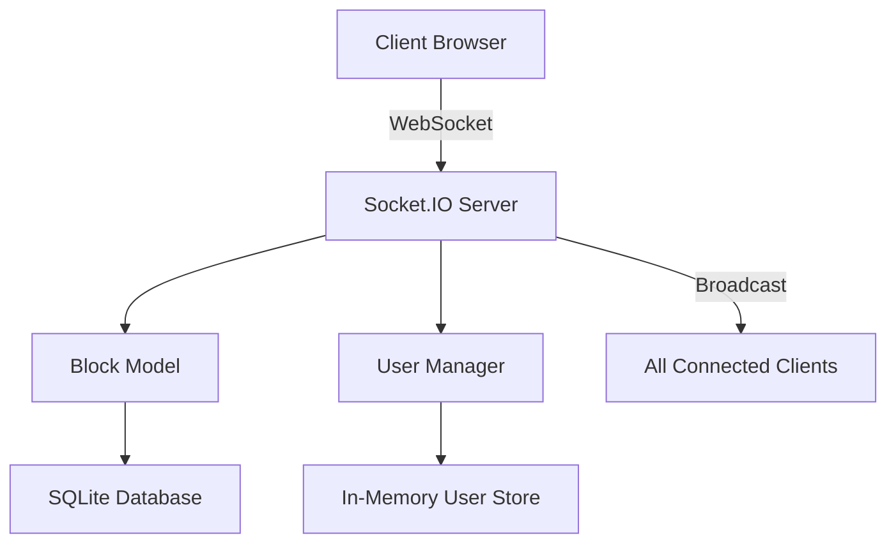

# BlockClaim - Real-time Block Capture Game 🎮

A real-time multiplayer web application where users can claim blocks on a shared 50×50 grid. Watch other players claim blocks instantly as you compete for territory!


## 🚀 Features

### Core Gameplay
- **50×50 Grid**: 2,500 claimable blocks for endless competition
- **Real-time Updates**: See other players' claims instantly via WebSockets
- **Conflict Resolution**: First-come-first-served with proper race condition handling
- **Visual Feedback**: Smooth animations and color-coded ownership

### User Experience
- **Clean, Modern UI**: Responsive design that works on desktop and mobile
- **Unique User Colors**: Automatically assigned distinct colors for each player
- **Customizable Names**: Change your display name anytime
- **Zoom & Pan**: Navigate the large grid with smooth controls
- **Live Statistics**: Real-time leaderboard and player count

### Technical Features
- **WebSocket Communication**: Socket.IO for instant updates
- **Persistent Storage**: SQLite database with proper indexing
- **Mobile-First Design**: Touch gestures and responsive layout
- **Performance Optimized**: Canvas rendering with in-memory caching
- **Auto-Reconnection**: Seamless connection recovery

## 🛠️ Tech Stack

### Backend
- **Node.js** - Runtime environment
- **Express.js** - Web framework
- **Socket.IO** - Real-time bidirectional communication
- **SQLite3** - Lightweight database with persistence
- **UUID** - Unique user identification

### Frontend
- **Vanilla JavaScript** - No heavy frameworks, pure performance
- **HTML5 Canvas** - Smooth grid rendering
- **CSS3** - Modern styling with gradients and animations
- **WebSocket Client** - Real-time communication

### Architecture
- **Event-driven Design** - Clean separation of concerns
- **In-memory Caching** - Fast block lookups with database persistence
- **Modular Structure** - Grid renderer, socket handler, UI manager
- **Conflict Resolution** - Database-level uniqueness constraints

## 📁 Project Structure

```
blockclaim-app/
├── server/
│   ├── index.js              # Main Express server with Socket.IO
│   ├── models/
│   │   ├── Block.js          # Block management and database operations
│   │   └── User.js           # User management and color assignment
│   └── scripts/
│       └── initDatabase.js   # Database initialization script
├── public/
│   ├── index.html            # Main application page
│   ├── css/
│   │   └── style.css         # Modern, responsive styling
│   └── js/
│       ├── app.js            # Main application controller
│       ├── grid.js           # Canvas-based grid renderer
│       ├── socket-handler.js # WebSocket communication
│       ├── ui.js             # User interface management
│       └── utils.js          # Utility functions and helpers
└── package.json              # Dependencies and scripts
```

## 🚀 Getting Started

### Prerequisites
- Node.js 16+ 
- npm or yarn

### Installation

1. **Clone the repository**
   ```bash
   git clone <repository-url>
   cd blockclaim-app
   ```

2. **Install dependencies**
   ```bash
   npm install
   ```

3. **Initialize the database**
   ```bash
   npm run init-db
   ```

4. **Start the development server**
   ```bash
   npm run dev
   ```

5. **Open your browser**
   Navigate to `http://localhost:3000`

### Production Deployment

1. **Start the production server**
   ```bash
   npm start
   ```

The server will run on port 3000 by default, or the port specified in the `PORT` environment variable.

## 🎯 How It Works

### Real-time Architecture



### Block Claiming Process

1. **User clicks** on an empty block in the grid
2. **Frontend sends** claim request via WebSocket
3. **Server validates** coordinates and checks ownership
4. **Database attempt** to insert block with unique constraint
5. **Conflict resolution** handles simultaneous claims
6. **Broadcast result** to all connected users instantly
7. **Visual update** with smooth animation

### Conflict Resolution

The app handles race conditions through:
- Database-level unique constraints on (x, y) coordinates
- In-memory caching for fast duplicate detection  
- Server-side validation before database operations
- Graceful failure messages for conflicting claims

## 🔧 Configuration

### Environment Variables

```bash
PORT=3000                    # Server port (default: 3000)
DB_PATH=./server/data/       # Database storage path
MAX_GRID_SIZE=50             # Grid dimensions (50×50 = 2,500 blocks)
```

### Customization

- **Grid Size**: Modify `gridSize` in `server/index.js`
- **Colors**: Update color palette in `server/models/User.js`
- **Block Size**: Adjust `blockSize` in `public/js/grid.js`
- **Animations**: Modify durations in CSS and JavaScript files

## 📊 Performance Optimizations

### Frontend
- **Canvas Rendering**: Hardware-accelerated drawing
- **Viewport Culling**: Only render visible blocks
- **Event Throttling**: Smooth panning and zooming
- **In-memory State**: Fast lookups without DOM queries

### Backend
- **In-memory Caching**: Block data cached in Map for O(1) lookups
- **Database Indexing**: Optimized queries with proper indexes
- **Connection Pooling**: SQLite with WAL mode for concurrency
- **Event Broadcasting**: Efficient Socket.IO room management

### Network
- **WebSocket Compression**: Reduced bandwidth usage
- **Delta Updates**: Only send changed data
- **Auto-reconnection**: Graceful handling of connection drops
- **Heartbeat Monitoring**: Connection health checks

## 🚧 Trade-offs Made

### Scalability vs Simplicity
- **Choice**: SQLite for simplicity
- **Trade-off**: Limited to single-server deployment
- **Future**: Could migrate to PostgreSQL + Redis for multi-server

### Consistency vs Performance  
- **Choice**: In-memory caching with database persistence
- **Trade-off**: Potential data loss if server crashes before sync
- **Mitigation**: Frequent database writes and WAL journaling

### Real-time vs Resources
- **Choice**: Broadcast all block claims to all users
- **Trade-off**: Network overhead grows with user count
- **Future**: Could implement spatial partitioning for large user bases

## 🐛 Known Issues & Limitations

1. **Single Server**: No horizontal scaling (could add Redis)
2. **Memory Usage**: Grows with claimed blocks (could add cleanup)
3. **Mobile Safari**: Some touch gesture limitations
4. **Large Grids**: Performance degrades beyond 100×100

## 🛣️ Future Enhancements

### Gameplay Features
- [ ] Territory control rules (adjacent blocks)
- [ ] Power-ups and special abilities
- [ ] Timed challenges and events
- [ ] Team-based gameplay modes
- [ ] Block decay/expiration system

### Technical Improvements
- [ ] Horizontal scaling with Redis
- [ ] Progressive Web App (PWA) support
- [ ] WebRTC for peer-to-peer updates
- [ ] Machine learning for bot players
- [ ] Analytics and telemetry

### UI/UX Enhancements
- [ ] Minimap for navigation
- [ ] Sound effects and haptic feedback  
- [ ] Themes and customization
- [ ] Player avatars and profiles
- [ ] Chat and social features

## 🧪 Testing

Run the application locally and test:

1. **Multi-user**: Open multiple browser tabs
2. **Real-time**: Claim blocks and see instant updates
3. **Conflicts**: Multiple users clicking same block
4. **Mobile**: Test on phones/tablets
5. **Connection**: Test with network interruptions

## 📈 Monitoring

The app includes built-in monitoring:
- Connection status indicators
- Performance metrics (FPS counter)
- Real-time user and block statistics  
- Debug mode for development

## 👥 Contributing

1. Fork the repository
2. Create a feature branch (`git checkout -b feature/amazing-feature`)
3. Commit your changes (`git commit -m 'Add amazing feature'`)
4. Push to the branch (`git push origin feature/amazing-feature`)
5. Open a Pull Request

## 📄 License

This project is licensed under the MIT License - see the [LICENSE](LICENSE) file for details.

## 🙏 Acknowledgments

- Socket.IO team for excellent real-time communication
- Inter font family for clean typography
- Modern browser APIs for smooth performance

---

**Built with ❤️ for real-time multiplayer gaming**

Try it live: [BlockClaim Game](your-deployment-url-here)